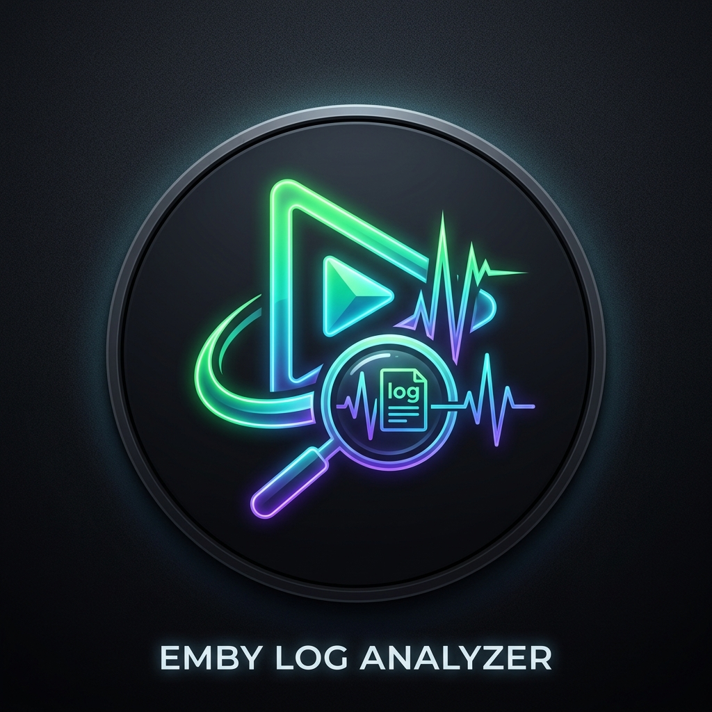

# Emby Log Analyzer

<p align="center">
  
</p>

<p align="center">
  <strong>High-performance cross-platform desktop application and correlation engine for Emby Server and FFmpeg transcode logs.</strong>
</p>

<p align="center">
  
  
  
  
</p>

---

## 🌟 Overview

**Emby Log Analyzer** solves one of the most frustrating challenges for home media administrators: diagnosing why a media playback session froze, buffered excessively, crashed, or terminated unexpectedly. 

By analyzing **Emby Server logs** (`embyserver*.txt`) and **FFmpeg transcoding logs** (`ffmpeg-transcode-*.txt`) simultaneously, the analyzer intelligently correlates processes and determines:
- Whether playback was **Direct Play**, **Direct Stream**, or **Transcoded**.
- Which specific FFmpeg transcode worker belonged to which Emby playback session.
- What the true root cause was (hardware acceleration crash, network drop, storage partition full, filesystem permissions, corrupted media, or codec mismatch).
- A calculated **confidence score** (0–100%) backed by raw log evidence.
- Actionable, step-by-step troubleshooting recommendations.

---

## ✨ Key Features

- **Automated Multi-Log Correlation**: Links sessions across disparate files using session IDs, play session tokens, transcode job hashes, and timestamp alignment.
- **Root Cause Diagnostic Engine**: Categorizes failures across:
  - **Hardware Acceleration**: NVIDIA NVENC, Intel QuickSync (QSV), Linux VAAPI, AMD AMF, CUDA.
  - **Storage & Disk I/O**: Transcode temporary cache exhaustion (`No space left on device`).
  - **Permissions**: Read/write access denials (`EACCES` / `Access is denied`).
  - **Network & Client Interruption**: Client disconnections, Wi-Fi drops, reverse proxy timeouts.
  - **Codecs & Media Bitstreams**: Corrupted MKV headers, missing moov atoms, unsupported pixel formats.
- **Privacy-First Local AI Explanation**: Generates plain-language executive summaries locally without transmitting log data to third-party cloud services.
- **Chronological Timeline Reconstruction**: Merges server events and transcoder execution traces into an interactive visual timeline.
- **Multi-Format Exporting**: One-click reports in **HTML**, **Markdown**, and **JSON**.
- **Modern Dark Desktop GUI**: High-tech interface with drag-and-drop ingestion, interactive confidence gauges, and status badges.
- **Headless CLI Utility**: Automate diagnostics on headless Linux servers or CI pipelines via `node cli/cli.js`.
- **Extensible Knowledge Base**: Customize and expand diagnostic rules via JSON (`src/engine/kb/rules.json`).

---

## 🚀 Getting Started

### Prerequisites
- Node.js (v18.0.0 or later)
- npm or yarn

### Installation
```bash
# Clone the repository
git clone https://github.com/ER-Emby-LogAnalyzer.git
cd ER-Emby-LogAnalyzer

# Install dependencies
npm install
```

### Running the Desktop GUI
```bash
npm start
```

### Running Headless CLI Mode
```bash
# Inspect logs and print diagnostic report to terminal
./cli/cli.js /path/to/embyserver.txt /path/to/ffmpeg-transcode-*.txt

# Export diagnostic report to HTML
./cli/cli.js -f html -o report.html ./test-datasets/03-failed-transcode-nvenc-driver-crash
```

### Running Automated Test Suite
```bash
npm test
```

---

## 📦 Building Executables

### Linux (AppImage / Standalone)
```bash
npm run build:linux
```

### Windows (.exe Portable / Installer)
```bash
npm run build:win
```

---

## 🧪 Included Test Datasets

The repository provides comprehensive test fixtures under `test-datasets/` covering standard scenarios:
1. `01-direct-play-success`: Direct play with clean session completion.
2. `02-hardware-transcode-nvenc-success`: NVIDIA NVENC accelerated transcode.
3. `03-failed-transcode-nvenc-driver-crash`: Driver initialization failure and CUDA crash.
4. `04-network-client-disconnect`: Remote client drop and socket interruption.
5. `05-storage-disk-full`: Transcode cache partition running out of disk space.
6. `06-corrupted-media-container`: Broken MKV/EBML headers and bitstream errors.
7. `07-permission-denied-transcode-temp`: Read-only cache or restricted permissions.
8. `08-qsv-hardware-failure`: Intel QuickSync `/dev/dri/renderD128` failure.

---

## 📄 License

This project is licensed under the MIT License - see the [LICENSE](LICENSE) file for details.

Copyright (c) 2026 **Eidolf**
